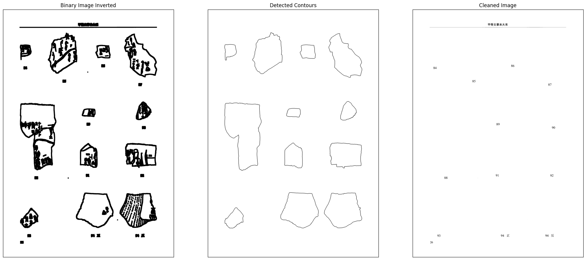

# PDF Rubbing Cropper - README



## 🚀 Get Started

Video:
<video width="640" height="480" controls>
  <source src="installation.mp4" type="video/mp4">
  Your browser does not support the video tag.
</video>

To use the app locally, follow the steps below:

1. Download the code from this repository (using Zip download above or `git clone`) and extract the files onto a folder on your local machine.
2. Install latest [python](https://www.python.org/downloads/) (recommended to follow the default instructions, be sure to check the option to `add python to PATH` during installation)
3. Install Dependencies

   - Navigate to the project directory (where the code is extracted)
   - Right Click to open context menu, select `Open In Terminal`
   - Run the following command in the terminal to install all the required packages

```bash
pip install -r requirements.txt
```

📦 Running the Image Cropping Script

- Navigate to the `scripts/` directory
- Open terminal in the `scripts` directory
- Run the following command to crop from any PDF files (parameters can be adjusted as needed)

```bash
python pdfcropper.py --src_pdf="../test/test.pdf" --dst_path="../output" --mode="poly" --dpi=600 --start_page=1 --end_page=-1 --text_threshold="200, 100" --only_object=True
```

## 📝 Parameters

- `--src-pdf` : Path to the input PDF file, could be a relative path like `../data/input.pdf` (relative to current directory) or an absolute path like `C:/Users/username/Documents/input.pdf`
- `--dst_path`: Path to the output directory where the cropped images will be saved, could be a relative path like `../data/output` or an absolute path like `C:/Users/username/Documents/output`
- `--start_page`: Page number to start cropping from. Default is 1.
- `--end_page`: Page number to end cropping at. Default is -1, which means crop till the last page.
- `--mode`: Mode of cropping, could be `rect` or `poly`. `rect` mode will use the bounding rectangle of the contours (x, y, width, height), `poly` will use the polygon outline of the contours ((x0, y0), (x1, y1), ...). Polygon will result in much higher precision cropping, on account of it wraps around the object tightly using polygon approximation, however, it has problems with open contours. Rectangles are safer in most cases, however, if the one of the primary objects is extending into the margin of the other one (overlapped boxes), it will cancel each other out, which could happen a lot in modern publications. In most cases, "poly" mode is recommended, unless the objects-to-be-cropped have unclosed shapes.
- `--dpi`: Resolution of the image to be saved. Usually higher value results in larger and clearer images. But different PDF engines has different built-in resolution, often the native value of the source PDF might be preferred to maintain consistency. For instance, Abbyy finereader image conversion use a 600dpi, consider changing this if needed to avoid image dimension discrepancy.
- `--text_threshold`: The threshold for distinguishing between the text and the rubbing (or Primary Object), in width and height, those smaller than the threshold will be considered a number text. Example: 200, 100. In my current version of pdf, the width for a 2-digit number is from 15-30 (depending whether there are postfixes like 正，反), the height is 10-20. For four or five digits, width might be 50-100. Also take into account the erosion morphing which will expand the number pixels depending on the kernal size used. So, give it a 50% to 100 percent reserve space.
- `--only_object`: A parameter for debugging purposes. If true, only the primary objects will be saved, the page with objects replaced by white background will not be saved. This is useful for debugging the precision of the object detection and cropping process and adjustments of relevant parameters.

## 🌲 Project Structure

- `modules/`: Contains the source code for utilities functions and classes that are used in the main script.
- `notebooks/`: Contains the Jupyter Notebooks used for testing and development.
- `scripts/`: Contains the main script for cropping the images from the PDF.
- `test/`: Contains the test PDF files used for testing the script.
- `requirements.txt`: Contains the list of dependencies required for the project.
- `README.md`: Contains the instructions for running the script and other details about the project.
